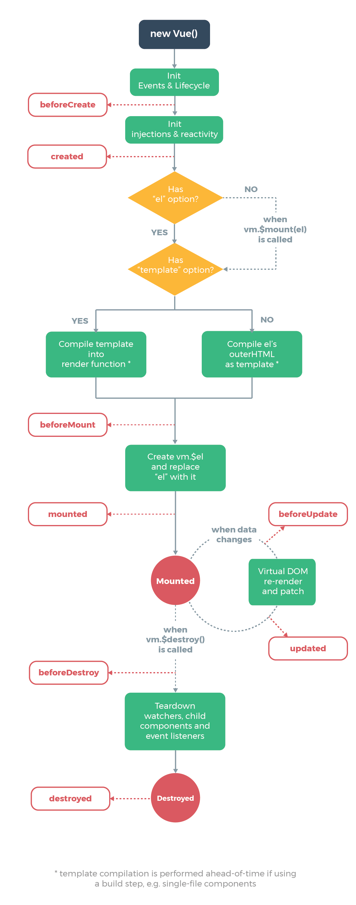

vue2生命周期执行顺序回顾

| vue2 | vue3-Options API | vue3-Composition API |
| --- | --- | --- |
| beforeCreate | beforeCreate | setup |
| created | created | |
| beforeMount | beforeMount | onBeforeMount |
| mounted | mounted | onMounted |
| beforeUpdate | beforeUpdate | onBeforeUpdate |
| updated | updated | onUpdated |
| beforeDestroy | beforeUnmount | onBeforeUnmount |
| destroyed | unmounted | onUnmounted |
| activated | activated | onActivated |
| deactivated | deactivated | onDeactivated |
| errorCaptured | errorCaptured | onErrorCaptured |
| renderTracked  Dev only | renderTracked | onRenderTracked |
| renderTriggered Dev only | renderTriggered | onRenderTriggered |

